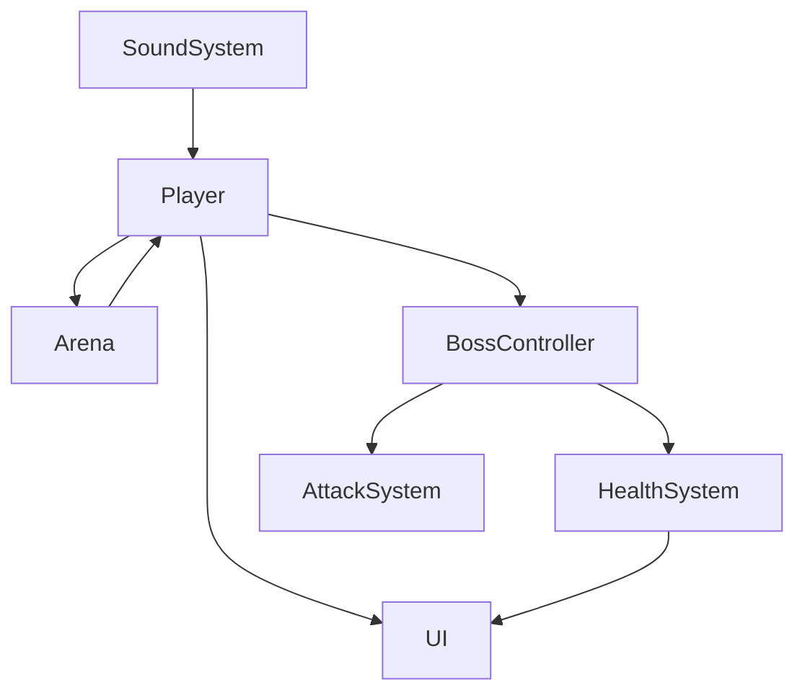
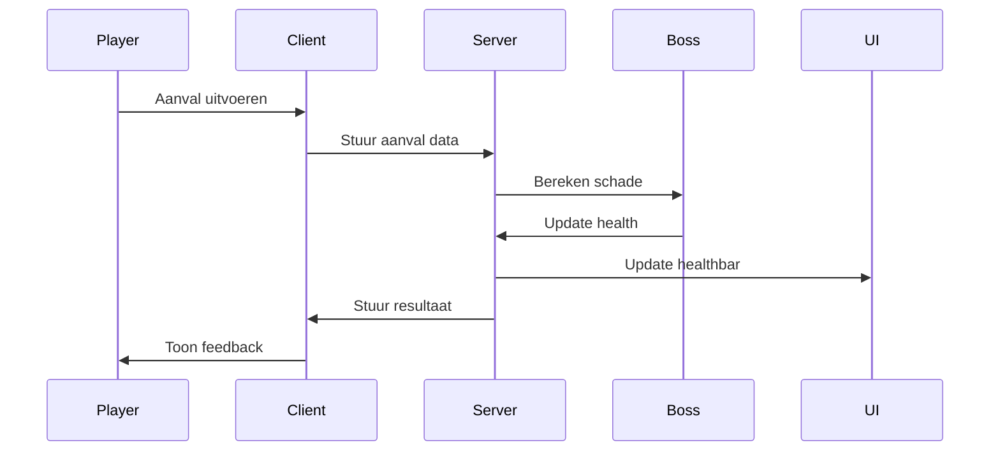

# Diagrammen – Hollowcaster Bossfight

## Applicatie-overzicht

---

## Datastroom / API-flow

---

## Prompt 6 – Diagrammen maken met Mermaid

"Maak twee Mermaid-diagrammen voor een Roblox bossfight-project: één applicatie-overzicht en één datastroom/sequence diagram. Gebruik duidelijke componentnamen."
